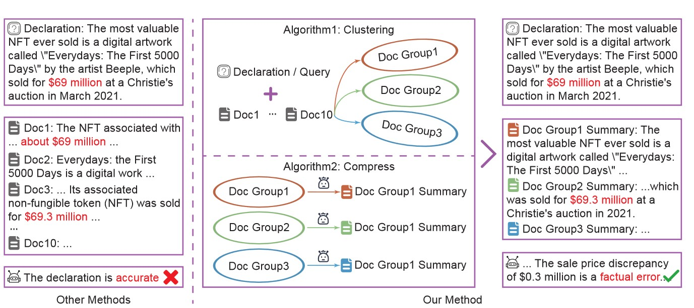

# Important !!! Improved Testing Results !!! Please read this ReadME !!! To run my testing dataset view the bottom of the README.md !!!! #

# EDC²-RAG: Efficient Dynamic Clustering-Based Document Compression for Retrieval-Augmented-Generation


This repository contains an extension of the original **EDC²-RAG**, a plug-and-play document preprocessing framework that enhances Retrieval-Augmented Generation (RAG) by dynamically clustering and compressing retrieved documents. Their method improves the robustness, relevance, and factuality of LLM-based generation systems by leveraging fine-grained inter-document relationships. And my method adapt it for a wider range of models.

## 🔍 Overview

Retrieval-Augmented Generation (RAG) enhances LLM outputs by integrating external documents. However, current RAG systems often suffer from **noise**, **redundancy** in retrieved content.

**EDC²-RAG** addresses these issues via:
- 🔗 **Dynamic Clustering** of documents based on semantic similarity.
- ✂️ **Query-aware Compression** using LLMs to eliminate irrelevant or redundant content.
- 🧠 A more informative and coherent context for generation.

However the RAG system is not widely applicable to open source models or other models besides GPT

**EDC²-RAG NEW** addresses these issues via:
- 🔗 **Refactoring** of the API hardcode endpoints.
- ✂️ **Sequential Processing** instead of multithreading to support lower tier models than GPT.
- 🧠 A more adapative and pluggable design for RAG systems.



## 🚀 OG Features

- 📚 **Noise & Redundancy Reduction**: Fine-grained document-level structuring.
- 🧩 **Plug-and-Play**: No fine-tuning required, compatible with any retriever or LLM.
- ⚡ **Efficient**: Reduces hallucinations while minimizing inference overhead.
- 🧪 **Extensive Evaluation**: Verified across hallucination detection and QA tasks.

## 🚀 NEW Features

- 📚 **Open Router Models**: Endpoints for Open Router Models.
- 🧩 **Hugging Face Compatability**: Compatible with Hugging Face models.
- ⚡ **Local LLM Compatability**: Compatible with local models.
- 🧪 **Hybrid LLM and Embedding Method**: Altered Classification method.

## 🧱 Architecture

1. **Document Retrieval**  
   Standard retriever (e.g., DPR) fetches top-k documents.

2. **Dynamic Clustering**  
   Documents are grouped based on similarity to the query and each other.

3. **LLM-based Compression**  
   Each cluster is summarized using prompts tailored to the query.

4. **Answer Generation**  
   The refined, dense context is passed to the LLM for final answer generation.

## 📊 Experimental Results

**Original Testing Results**

| Dataset        | Metric    | RALM | Raw Compression | EDC²-RAG (OG) |
|----------------|-----------|------|------------------|------------------|
| TriviaQA       | F1 Score  | 93.78 | 93.29           | **93.81**        |
| WebQ           | F1 Score  | 88.75 | 88.25           | **89.23**        |
| FELM           | Bal. Acc. | 55.65 | -----           | **62.26**        |

See the original paper for full ablation studies and robustness testing.

**Run 1 of my Testing Results**

| Query Size     | Metric    | EDC²-RAG (OG) |
|----------------|-----------|---------------|
| 25             | F1 Score  | **92.53**     |
| 50             | F1 Score  | **89.69**     |
| 100            | F1 Score  | **87.55**     |

Used with TriviaQA, GPT 3.5 Turbo

**Run 2 of my Testing Results**

| Query Size     | Metric    | EDC²-RAG (OG) |
|----------------|-----------|---------------|
| 25             | F1 Score  | **94.67**     |
| 50             | F1 Score  | **93.69**     |
| 100            | F1 Score  | **91.82**     |

Used with TriviaQA, GPT 3.5 Turbo, and undid prior changes to classification prompt

## 🧪 Getting Started - Testing my Dataset

If you want to replicate my datasets go to this file -> codes/eval_scripts/run_baseline_compress.py
It explains all these steps and includes commands in the comments to rerun the script.
Must have this file to run the dataset -> triviaq/OG/triviaq_results_w_negative_passages_full.json

## 🧪 Getting Started - Testing your own Dataset

### 1. Install Dependencies

```bash
pip install -r requirements.txt
```

### 2. Create a split of original dataset

```bash
python codes/eval_scripts/make_dev_split.py triviaq 50
```

You can replace the 50 with the number of questions you want

### 3. Set Variables

```bash
eval_model=gpt35_turbo
date=0608
dataset=triviaq
topkk="[20]"
noises="[0]"
benchmark=full

```

You use your variables with each input them in each field then copy that into the terminal


### Option 3.1 Evaluate Results

```bash
python codes/eval_scripts/run_baseline_compress.py "$eval_model" "$date" "$dataset" "$topkk" "$noises" "$benchmark"
```

### Option 3.2 Run the pipeline individually

Make the dataset

```bash
python codes/datasets/make_datasets.py "$dataset" "$topkk" "$noises" "$eval_model"
```

Make the summary 

```bash
python codes/datasets/baseline_compress.py "$eval_model" "$date" "$dataset" "$topkk" "$noises" "$benchmark"
```

Evalute response

```bash
python codes/run_methods/eval_baseline_compress.py "$eval_model" "$date" "$dataset" "$topkk" "$noises" "$benchmark"
```

Find Extracted Answer

```bash
python codes/eval_metric/extracted_answer_topkk_compress.py "$date" "$dataset" "$eval_model" "$topkk" "$noises" "$benchmark"
```

Calculate Results

```bash
python codes/eval_metric/caculate_F1_EM_compress.py "$date" "$dataset" "$eval_model" "$topkk" "$noises" "$benchmark"
```

OG Message: Up to now, we have only released the evaluation code and datasets related to the main experiments on TriviaQA and WebQ. We will later update the code for the ablation studies and hallucination detection datasets. If you need additional datasets or code, please feel free to contact us.

---
